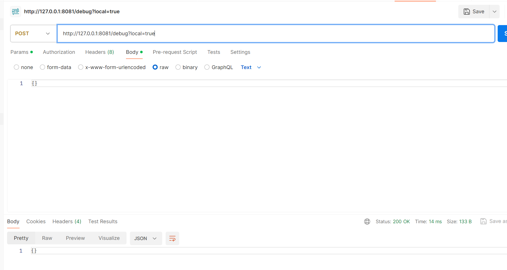

request for remote

fails


and the stacktrace
```
2024-05-09 17:59:51.856 [io-compute-1] TRACE o.h.ember.client.EmberClientBuilder Shutting Down Connection - RequestKey: https://httpbin.org
2024-05-09 17:59:53.932 [io-compute-blocker-13] TRACE o.h.ember.client.EmberClientBuilder Created Connection - RequestKey: https://httpbin.org
2024-05-09 17:59:53.933 [io-compute-blocker-13] TRACE o.h.ember.client.EmberClientBuilder Connection Taken - Key: https://httpbin.org - Reused: false - PoolState: (0,Map())
2024-05-09 17:59:55.294 [io-compute-5] INFO  <empty>.Debug Response body: {
  "args": {}, 
  "data": "{}", 
  "files": {}, 
  "form": {}, 
  "headers": {
    "Content-Length": "2", 
    "Content-Type": "application/json", 
    "Date": "Thu, 09 May 2024 09:59:53 GMT", 
    "Host": "httpbin.org", 
    "User-Agent": "http4s-ember/1.0.0-M41", 
    "X-Amzn-Trace-Id": "Root=1-663c9e9b-3727aeef40f14cd553f4acbf"
  }, 
  "json": {}, 
  "origin": "123.123.72.29", 
  "url": "https://httpbin.org/post"
}

2024-05-09 17:59:55.295 [io-compute-5] TRACE o.h.ember.client.EmberClientBuilder Shutting Down Connection - RequestKey: https://httpbin.org
org.http4s.ember.core.Parser$Body$BodyAlreadyConsumedError: Body Has Been Consumed Completely Already
	at org.http4s.ember.core.Parser$Body$BodyAlreadyConsumedError$.apply(Parser.scala:597)
	at org.http4s.ember.core.Parser$Body$.$anonfun$2(Parser.scala:621)
	at fs2.Pull$$anon$1.cont(Pull.scala:149)
	at fs2.Pull$BindBind.cont(Pull.scala:735)
	at fs2.Pull$ContP.apply(Pull.scala:683)
	at fs2.Pull$ContP.apply$(Pull.scala:682)
	at fs2.Pull$Bind.apply(Pull.scala:691)
	at fs2.Pull$Bind.apply(Pull.scala:691)
	at fs2.Pull$.goEval$1$$anonfun$1(Pull.scala:1097)
	at get @ fs2.internal.Scope.openScope(Scope.scala:275)
	at flatMap @ fs2.Compiler$Target.flatMap(Compiler.scala:163)
	at flatMap @ fs2.Pull$.goCloseScope$1$$anonfun$1$$anonfun$3(Pull.scala:1217)
	at update @ org.http4s.ember.server.internal.Shutdown$$anon$1.<init>(Shutdown.scala:78)
	at flatMap @ fs2.Compiler$Target.flatMap(Compiler.scala:163)
	at flatMap @ fs2.Compiler$Target.flatMap(Compiler.scala:163)
	at flatMap @ fs2.Compiler$Target.flatMap(Compiler.scala:163)
	at flatMap @ fs2.Compiler$Target.flatMap(Compiler.scala:163)
	at flatMap @ fs2.Compiler$Target.flatMap(Compiler.scala:163)
	at flatMap @ fs2.Compiler$Target.flatMap(Compiler.scala:163)
	at modify @ org.http4s.ember.server.internal.Shutdown$$anon$1.<init>(Shutdown.scala:90)
	at flatMap @ fs2.Compiler$Target.flatMap(Compiler.scala:163)
	at flatMap @ fs2.Pull$.goCloseScope$1$$anonfun$1(Pull.scala:1218)
	at handleErrorWith @ fs2.Compiler$Target.handleErrorWith(Compiler.scala:161)
	at flatMap @ fs2.Pull$.goCloseScope$1(Pull.scala:1225)
	at get @ fs2.internal.Scope.openScope(Scope.scala:275)
```

success


request for local always success

